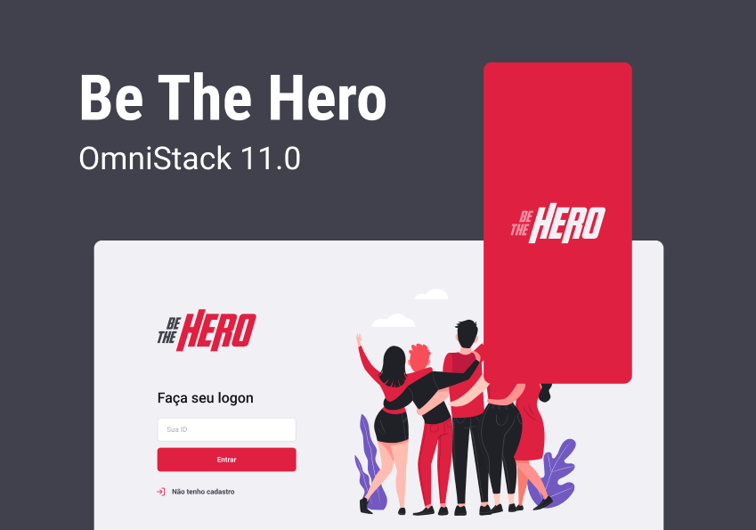
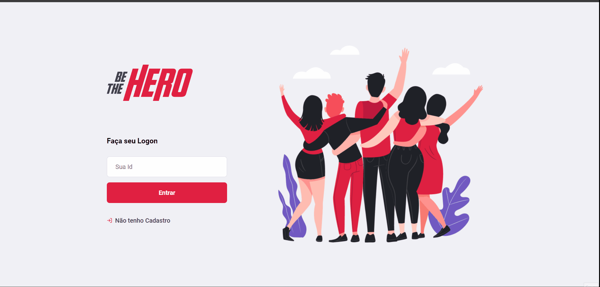

# BE THE HERO

    

# SEJA O HERÓI.

## Este sistema tem por finalidade  unir ONG's e pessoas dispostas a tornar o mundo um lugar melhor para os animais.

### Funcionalidades para Ongs:
    * Cadastro de ONG's
    * Login em plataforma de administração.
    * Gerenciar casos que precisem da atenção do público.
    * Vincular Whatsapp e E-mail para contato com o público

### Funcionalidades para o Público.
    * Ter acesso a todos os casos de todas Ong's cadastradas no sistema.
    * Ao clicar no caso, será direcionado a uma sessão de detalhes.
    * Na sessão de Detalhes é possivel entrar em contato com a ONG atraves de Whatsapp e Email.

## Instalação do Sistema

### 0- Clone o repositório em sua maquina.

### 1- Execute o `npm install` no BACKEND, FRONTEND e MOBILE para instalar as dependências.

### 2- Verifique o localhost dentro de `MOBILE / SRC / SERVICES / API` e altere as configurações do baseUrl para o endereço ip da maquina onde for executar o sistema.

### 3- Execute o ` npm start ` no BACKEND, FRONTEND e MOBILE

### Agora crie sua ong e aproveite ao maximo essas funcionalidades.
### Código liberado para aprimoramentos, faça o FORK e me ajude a corrigir futuros BUG's e adicionar novas funções.

## Demonstração Desktop e Mobile

## Tecnologias Utilizadas no desenvolvimento.

- Linguagem de Programação: 
- Biblioteca Web: 
- Biblioteca de Teste: 
- Framework Web:   
- Franmework de Teste: 
- Plataforma: 
- Ferramenta de Desenvolvimento:   
- Banco de Dados: 
- Mecanismo de Segurança: 
- Frontend:    
- Versionamento de Código: 

## Realizado em Workshop da RocketSeat

# Author
### Josué Ocanha Costa
#### FrontEnd Developer
#### Redes Sociais

- Linkedin - [JosueOcanhaCosta](https://www.linkedin.com/in/josue-ocanha-costa/)
- Github - [JosueCosta2023](https://github.com/JosueCosta2023)
- Twitter - [@JosueOcanhaCosta](https://twitter.com/josue_ocanha)
- Facebook - [JosueCosta](https://www.facebook.com/JosueOcanhaCosta2023)
- Whatsapp - [Josue2023](https://wa.me/5565996408371?text=Ol%C3%A1%2C+encontrei+seu+whatsapp+no+Github.+Gostaria+de+falar+sobre+seus+projetos.)

# "Vida longa e próspera. 🖖🖖🖖"

